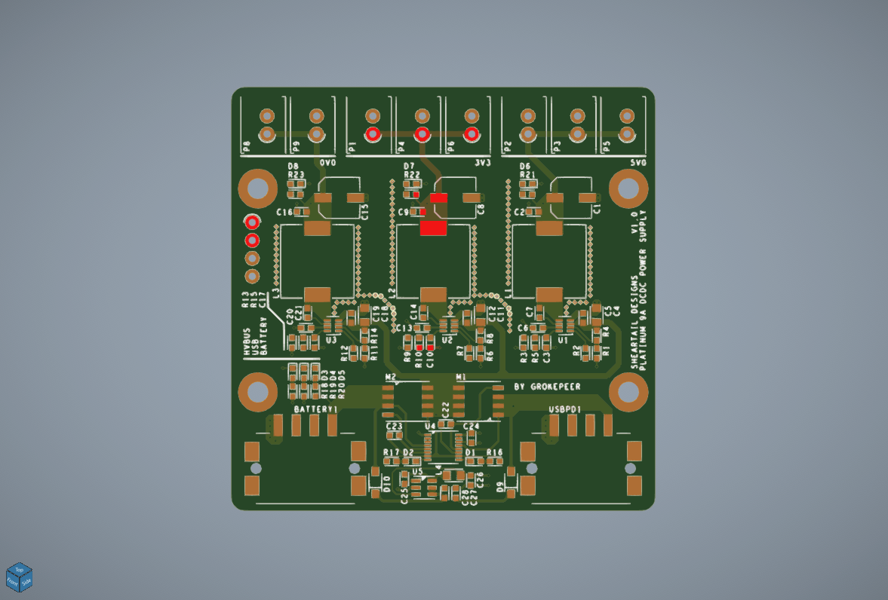
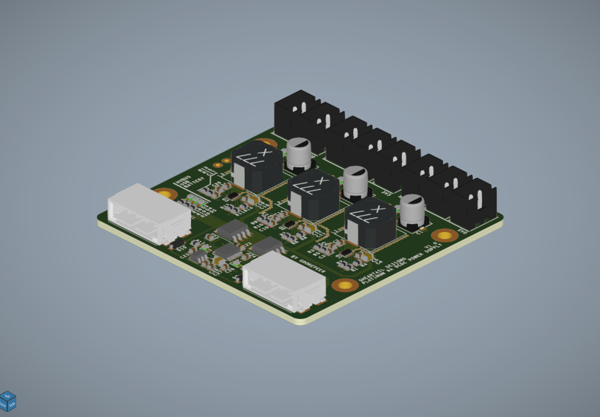
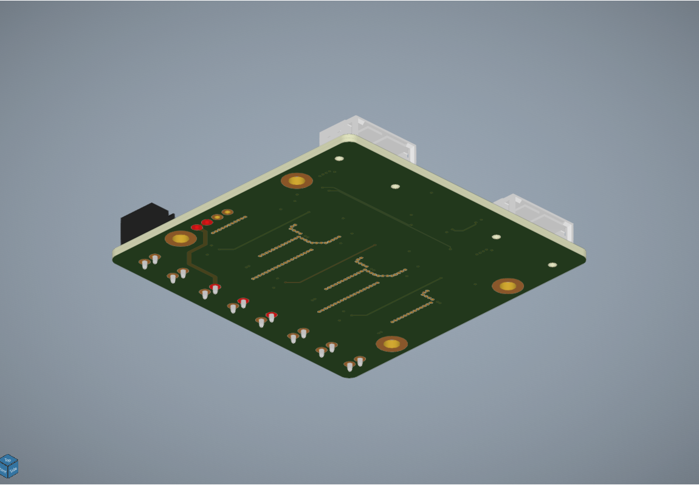

# Pulsar

> [!WARNING]
> Attention! This project is currently under rapid development so some of the content below might be not yet available or incorrect. If you are interested in the project and/or the development of the following, add the repo to your watch list and star it!

This document contains an overview of the project, a simple description of its parts and its development process, basic instructions on how to build your own Pulsar and how to use it, along with some renders and pictures. 
I hope you will enjoy the process and you are always welcome to open an issue for feedbacks and questions.

- Want to know more about the project? Take a look at the [synopsis](#synopsis).
- Curious about the development? Read more [here](#technical-overview)
- Ready to build your own Pulsar? Jump [here](#production)
- Already holding onto your very own Pulsar, but unsure of how to use it? [This way](#operation)

## Synopsis

The Pulsar is a highly portable off-grid radio communication system. The goal is to create a small (hand-held), battery powered, system that can utilize multiple frequencies and high-power RF power amplifiers to allow long-range, decentralized, reliable and secure, communication between two or more nodes. 
The system is open-source and open-hardware so that anybody that is interested can build one on its own and even modify the design or just his/her feedback.

## Table of contents

- [Repository Structure](#repository-structure)
- [Technical Overview](#technical-overview)
    - [Radio Modules](#radio-modules)
    - [Central Processor Unit](#central-logic-unit)
    - [Power Supply Unit](#power-supply-unit)
    - [Case](#case)
- [Production](#production)
    - [PCB Sourcing](#pcb-sourcing)
    - [PCB Assembly](#pcb-assembly)
    - [3D Printing](#3d-printing)
    - [Assembly and Firmware](#assembly-and-firmware)
- [Operation](#operation)
    - [To Arrive Soon]()

## Repository Structure

The repository is divided into 4 sections.
- The base folder along with the [images](./Images/) folder contain the README, LICENSE and some useful informations to get started. All of the informations contained in these folders are accessible in a organized matter in this README.
- The [3D Files](./3D%20Files/) folder contains 3D files (mainly STEP) that you will need to print to build your Pulsar (read more about this [here](#3d-printing)). It also contains some 3D models of the PCBs so that you can use them if you wish to integrate the PCBs into your own design.
- The [PCB Files](./PCB%20Files/) folder contains gerber files to send to your preferred PCB manufacturer, BOM files so that you can order all necessary components and the PCB's schematics.
- The [Firmware](./Firmware/) folder contains the STM32CubeMX project with all the STM32H733VG code and configuration files. A pre-compiled binary file will be provided on release. It's not recommended to build the code yourself, nor to modify it, if you don't know what you are doing.

## Technical Overview

Over this chapter I'm going to talk about each of the parts that make up the system, from the electronics to the 3D printed case.

To give a structural overview of the project, I'll give a quick list of its parts. The Pulsar is powered by a battery (3S LiPo/LiIon), uses a DC/DC PSU to power the main logic board (a STM32H7 based board) and a multitude of RF modules that are connected to the PSU and the main logic board. There are multiple physical user interfaces such as buttons and selectors and externally mounted antennas for the RF modules and GPS. A 3D printed case encloses everything.

### Radio Modules

The radio modules are SemTech SX1262 and SX1281 based modules that use LoRa modulation over a range of frequency as low as 100 MHz and as high as 2.4 GHz. LoRa is a popular, efficient and well adopted modulation system, so choosing it, rather then another, allows me to have access to a great choice of transceiver chips and plenty of documentation.

The modules are separated from the main board and power supply so they can be swapped easily and freely depending on preference. This allows me to plan the development of more powerful radio modules down the line.

The radio modules I'm going to use at first are Ebyte LoRa modules. These modules integrate an RF PA with an SX1262 or SX1281 chip and allow direct communication to the SemTech chip. So in case I swap the module for a different one, from another brand or a custom build one, I can always use the same interface, as long as I keep using the SemTech chip. This also means that I can use the SemTech provided programming documentation, indepedently from the module manufacturer, should it change eventually.

### Central Logic Unit

The main board, or CLU, connects together all modules and user interfaces. It does not provide power, that is left to the [PSU](#power-supply-unit).
The CLU inside the Pulsar is a 4 layer, 60 x 80 mm PCB with, at its core, a STM32H733VG.

### Power Supply Unit

To power the entire system with high-power RF modules and microcontrollers a proper DC/DC power supply is necessary. The RF modules use both 3.3 V and 5.0 V, the microcontroller uses 3.3V. So it was necessary to design a 2 rail DC/DC PSU. To allow the addition of a more powerful RF PA further down the line I also added the possibility to enable a 3rd rail at a voltage that can be defined easily after production, I will refer to this rail as the 0V0 DC/DC rail.

Since this system is also battery powered, it needs to be efficient, so the entire DC/DC needs to be extrememly efficient, and I wanted it to be able to switch to an external power source whenever necessary, without shutting down.

The PSU inside the Pulsar is a 4 layer, 60 x 60 mm PCB with 3, up to 3 A each, DC to DC rails and a ideal diode controller that can hot-swap between two power sources at voltages ranging from 8 V to 16 V. Each rail's switching controller can be chosen between a 3 A variant and a 2 A one, depending on projected consumption. On my design I decided to go with a 3 A, 5.0 V rail and a 2 A, 3.3 V. Based on simulations the 3.3 V rail can reach 94.8% efficiency at 50% load.

    
    
    

### Case

Case infos...

## Production

Over the course of this chapter I will go into some detail about how to procure yourself everything you need to create your own Pulsar, how to assemble it and program it.

### PCB Sourcing

In the [PCB Files](./PCB%20Files/) folder you will find the gerbers .zip files of all the PCBs that are necessary to build a functioning Pulsar. These files contain the PCB production informations such as copper pours polygons and drill holes. You will need to download all the gerber files and send them to your preferred PCB manufacturer (such as JLCPCB).

Particular PCB requirements and generic informations are provided here:
- The PSU board is a 4 layer, 60 x 60 mm board that doesn't need matched impedance nor a particularly high copper weight (1 oz. outer, 0.5 oz. inner will be fine). The board original thickness is 1.6 mm but you can make it thinner or thicker (although it might affect the ability to fit into the case).

## Operation

In the midst of this chapter you will find some suggestions regarding the ways of the firmware.

