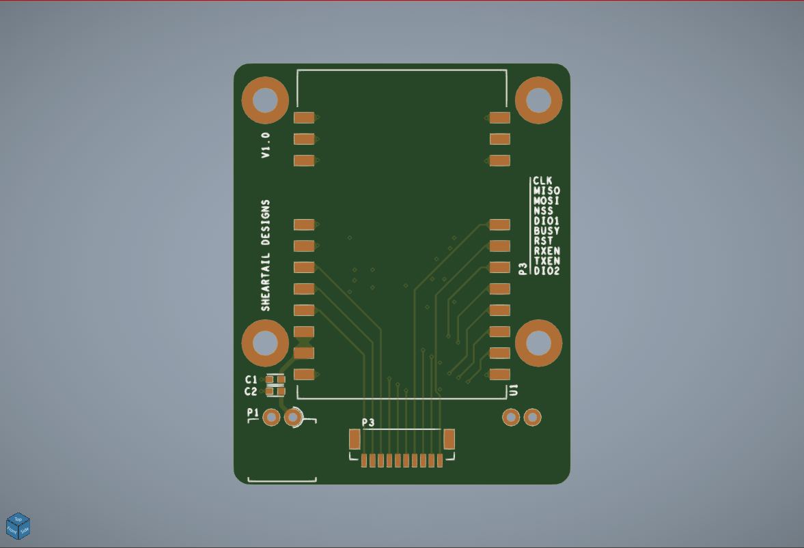
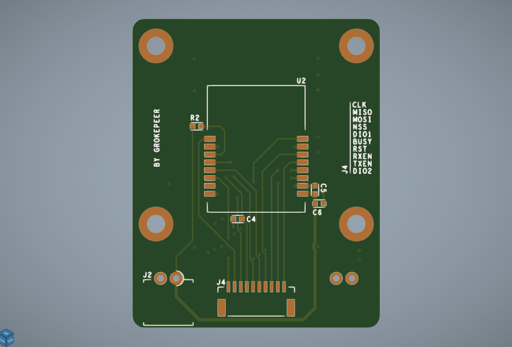
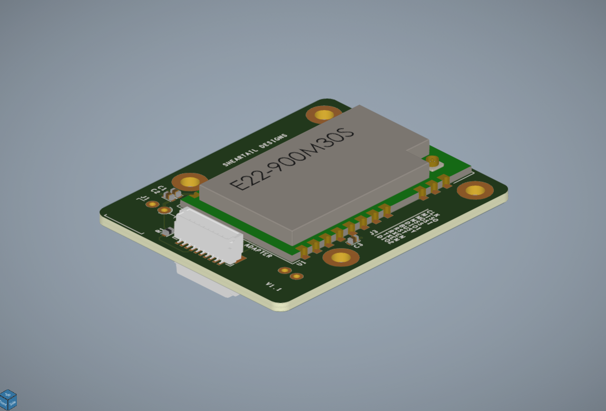
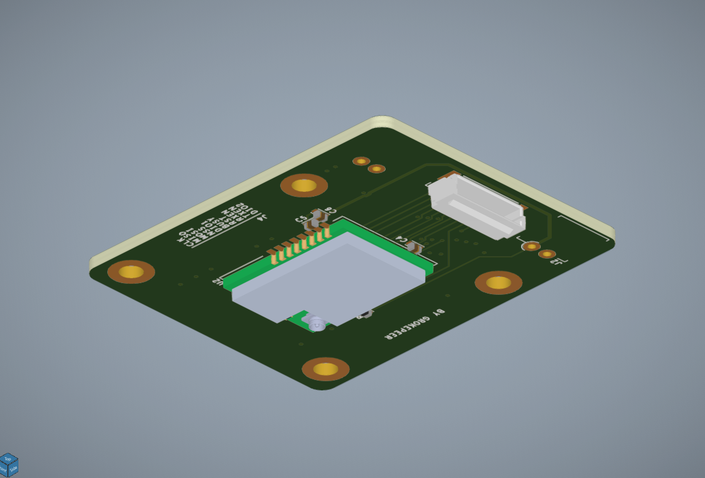
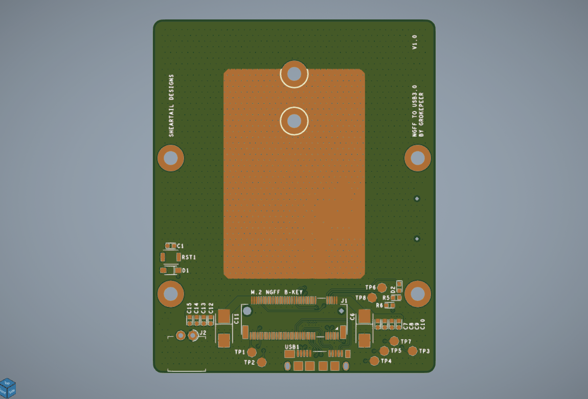
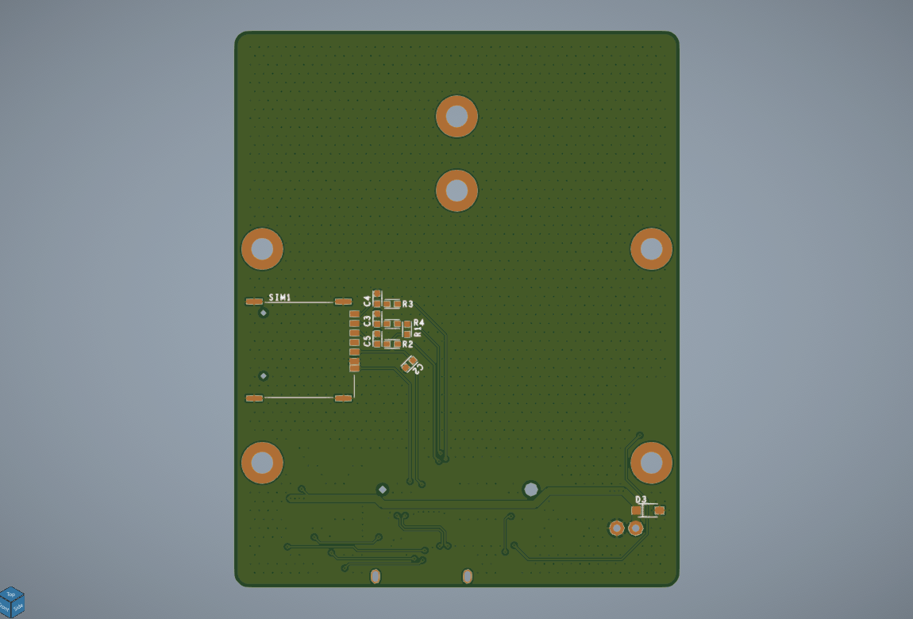
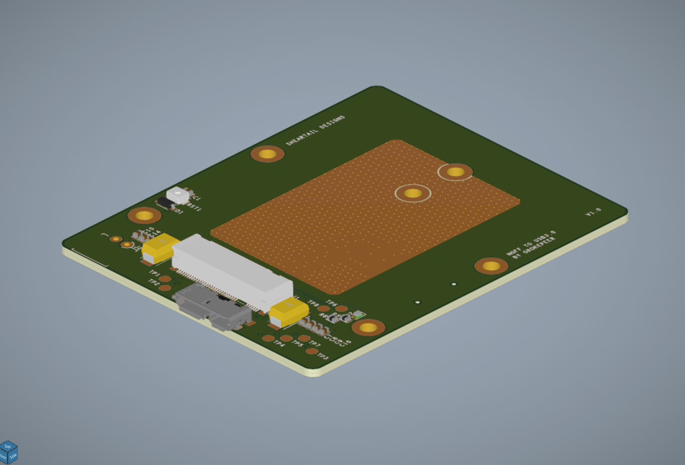
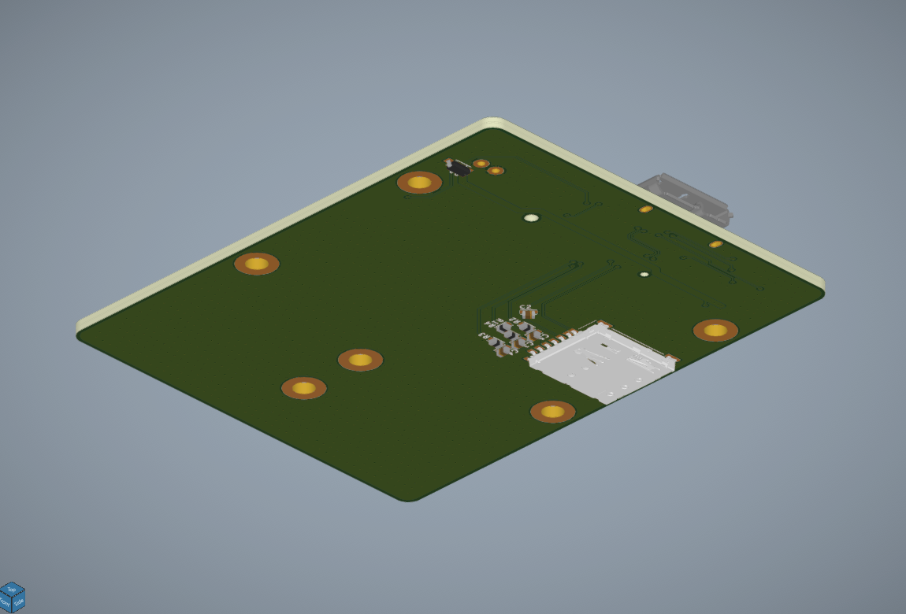

# Pulsar

> [!IMPORTANT]
> Hi! As you can see this project is completely open-source, but it's expensive to develope it, so I ask to anybody interested to consider supporting the project by subscribing to the Pulsar's newsletter [here](https://sheartail.net), this way you can receive updates about the kickstarter campaign I'm planning. There are gonna be awesome rewards for backers with handcrafted Pulsars and much more!
Thank you very much.

> [!WARNING]
> Attention! This project is currently under rapid development so some of the content below might not be available yet or incorrect.

> [!CAUTION]
> Always check with local authority about RF bands regulations in your area.

This document contains an overview of the project, a simple description of its parts and its development process, basic instructions on how to build your own Pulsar and how to use it, along with some renders and pictures. 
I hope you will enjoy the process and you are always welcome to open an issue for feedbacks and questions.

- Want to know more about the project? Take a look at the [synopsis](#synopsis).
- Curious about the development? Read more [here](#technical-overview)
- Ready to build your own Pulsar? Jump [here](#production)
- Already holding onto your very own Pulsar, but unsure of how to use it? [This way](#operation)

## Synopsis

The Pulsar is a highly portable, off-grid (and optionally on-grid), modular radio communication system. The goal is to create a small (hand-held), battery powered, system that can utilize multiple radio frequencies and high-power RF power amplifiers to allow long-range, decentralized, reliable and secure, communication between two or more nodes.

The modular design allows swapping of the RF modules independently of the main computer (CLU), keeping one standard interface for unlimited customizable setups.

Through the use of an optional 4G/5G module, the system can also communicate via traditional networks. Due to the need of a SIM to authenticate the user on a commercial network, this module, if installed, can be airgapped at any moment by the user. To operate the 4G/5G module an SBC running OpenWRT is needed. This way the main computer will have access to the 4G/5G lines through serial connetion to the SBC and you will have a fully featured router and 4G/5G modem that you can directly connect to via a dedicated wifi AP.

**Working Principle:** The main computer can connect to other devices (like smartphones, computers and even CSRF controllers) via bluetooth LE and serial wired ports. The conneted devices can send, via the serial line with the main computer, data that they need to send over the radio link. The main computer then uses the RF modules to communicate with another Pulsar (or compatible device), and send the data (encrypted). Once it's on the other Pulsar it can be sent via serial connection to the specific destination device that is connected to it.

#### Licensing

The system is open-source and open-hardware so that anybody that is interested can build one on its own and even modify the design or give his/her feedback.

The hardware is released under the CERN-OHL-S license (In particular, everything under [3D Files](./3D%20Files/) and [PCB Files](./PCB%20Files/)), while all software is released under GNU-Affero-GPL-V3 license.

## Table of contents

- [Repository Structure](#repository-structure)
- [Technical Overview](#technical-overview)
    - [Central Processor Unit](#central-logic-unit)
    - [Power Supply Unit](#power-supply-unit)
    - [Radio Modules](#radio-modules)
    - [Router Module](#router-module)
    - [Case](#case)
- [Production](#production)
    - [Tools](#tools)
    - [PCB Sourcing](#pcb-sourcing)
    - [PCB Assembly](#pcb-assembly)
    - [3D Printing](#3d-printing)
    - [Firmware Flashing](#firmware-flashing)
- [Operation](#operation)
    - [To Arrive Soon]()

> [!IMPORTANT]
> To keep this guide simple and understandable, in the following chapters I will refer to a particular configuration of the modules and parts, although the user knows that the system is highly customizable and can be changed from start to finish. The configuration that I will refer to is as follows: 3S battery, DCDC with 5.0V@3A, 3.3V@2A and 3.8V@3A (for the LTE module), a Raspberry Pi 3B SBC or similar WiFi and USB3 capable SBC, a Quectel LTE EM05 module, a generic UART GNSS 5V module, a single SX1281 2.4 GHz module powered from the 3.3 V and a single SX1262 868 MHz module powered from the 5.0 V.

## Repository Structure

The repository is divided into 4 sections.
- The base folder along with the [Images](./Images/) folder contains the README, LICENSE and some useful informations to get started. All of the informations contained in these folders are accessible in an organized matter in this README.
- The [3D Files](./3D%20Files/) folder contains 3D files (mainly STEP) that you will need to print to build your Pulsar (read more about this [here](#3d-printing)). It also contains some 3D models of the PCBs so that you can use them if you wish to integrate the PCBs into your own design.
- The [PCB Files](./PCB%20Files/) folder contains gerber files to send to your preferred PCB manufacturer, BOM files so that you can order all necessary components and the PCB's schematics.
- The [Firmware](./Firmware/) folder contains the STM32CubeMX project with all the STM32H733VG code and configuration files. A pre-compiled binary file will be provided on release. It's not recommended to build the code yourself, nor to modify it, if you don't know what you are doing.

## Technical Overview

Over this chapter I'm going to talk about each of the parts that make up the system, from the electronics to the 3D printed case.

To give a general overview of the project, I'll give a quick list of its parts. The Pulsar is powered by a battery (3S LiPo/LiIon), uses a DC/DC PSU to power the main logic board (CLU), the two LoRa RF modules, the Quectel module, the router SBC and the GPS module. The SBC and 4G/5G module can be turned on/off from the uC via relays that cutoff the power to the modules. There's also a rotary selector and a small display that the user can interface with. A 3D printed case encloses everything.

### Central Logic Unit

The main board, or CLU, connects together all modules and user interfaces. It does not provide power, that is left to the [PSU](#power-supply-unit).

The board has 4 MODx connectors that offer multiple GPIOs and an SPI interface, to connect to the RF modules (in particular, to connect directly to the SemTech SX1262 and SX1281 chips), 3 UARTs, one used to connect to the SBC, one for the GPS module and the third is left to allow external computers or controllers to connect, a single I2C that is used to connect to a small screen and a GPIO header that connects to user interfaces and the SBC's relays. 
On the baord you will also find an SD card slot that allows the system to save log files during operation, a coin battery that allows the internal RTC to remain active without the main battery, a small DIP switch that is used for configuration of the board, the JDY-23 bluetooth module, and the STM32H733VGT6 at the heart of the system with its debug interface connector (SWD).

The CLU inside the Pulsar is a simple 4 layer, 60 x 75 mm PCB, that can be hand-soldered.

    
    
    
    

### Power Supply Unit

To power the entire system with high-power RF modules, microcontrollers, an SBC and a 4G/5G modem, a proper DC/DC power supply is necessary. The RF modules use both 3.3 V and 5.0 V, the microcontroller uses 3.3V, the SBC uses 5.0 V and the Quectel module uses 3.8 V, so it was necessary to design a 3 rail DC/DC PSU. To allow the addition of a more powerful RF PA further down the line the 3.8 V line can be reconfigured to a range of voltages using the feedback voltage divider in DCDC switching IC (check the board schematics for more details).

Each rail's switching controller can be chosen between a 3 A variant and a 2 A one, depending on projected consumption. On my design I decided to go with two 3 A rails (3.8 V and 5.0 V) and a 2 A rail (3.3 V). Based on simulations the 3.3 V rail, powered at 15 V can reach 94.8% efficiency at 2A load. An ideal diode controller that can hot-swap between two power sources at voltages ranging from 8 V to 16 V is also integrated in the design.

The PSU inside the Pulsar is a 4 layer, 60 x 60 mm PCB, that can be hand-soldered.

    
    
    
    

### Radio Modules

Since the modules are connected via connectors you can integrate whatever radio module you want, as long as it can interface with the H733 using SPI.

The radio modules I decided to use are SemTech SX1262 and SX1281 based, and use LoRa modulation over a range of frequency as low as 100 MHz and as high as 2.4 GHz. LoRa is a popular, efficient and well adopted modulation system, so choosing it, rather then another, allows me to have access to a great choice of transceiver chips and plenty of documentation.

The specific modules I chose are from Ebyte: E22-xxxMxxS and E28-2G4MxxSX modules variaties. I then designed a simple carrier board that allows to connect both types of modules to the 10 pin MODx data connector and the power connector. It's noteworthy that these LoRa modules, unlike others, even from the same Ebyte, expose direct communication to the SemTech chip, so the SPI interface is exactly the same I would have using different SX1262/SX1281 modules (even completely custom ones).

    
    
    
    

### Router Module

The "on-grid" module is composed of an SBC that operates as a normal router and a LTE module that is connected to the SBC via USB (using a NGFF M.2 to USB adapter). Any device that connects to the router has access to the on-grid line and can therefore navigate the web, etc.. Most 4G/5G modems integrate a GNSS chip and antenna that is disabled by default on this design because of privacy concerns.

The SBC that I chose is a small Radxa Zero 3W that has integrated WiFi6 and a single USB3.0. To connect a NGFF M.2 LTE module I then designed an adapter to USB. The adapter is a separate "entity" from the SBC so that based on availability and design needs, the SBC can be changed, while keeping the USB 4G/5G module intact. For this reason I won't go into much detail about the SBC.

Because some CAT12+ LTE-A modules and 5G modules can saturate a single USB2.0 (480 Mbps) serial line, the board is designed with USB3.0 support (5.0 Gbps), requiring the design to incorporate impedance and phase matched lines.

Since some advanced modules consume a lot of power and produce plenty of heat, the board requires direct power from the DCDC (cannot be powered from USB at all) and presents a big heat-absorbing surface on the top side of the module, it also has copper pours on all layers and via arrays to help spread the heat from the module.

The NGFF to USB3.0 adapter is a 4 layer, 60 x 75 mm PCB, that should be produced with the JLC04161H-3313 stackup. It can be hand-soldered but I would suggest to leave the assembly of the NGFF and USB connector to a P&P machine.

    
    
    
    

### Case

Well, well, well... it's under development

## Production

Over the course of this chapter I will go into some detail about how to procure yourself everything you need to create your own Pulsar, how to assemble it and program it.

### Tools

You are going to need a couple different tools for the job.
- A soldering iron.
- I suggest you also acquire some experience with SMD soldering before starting to work on the following PCBs.
- Small tweezers to help you place SMD components on the boards.
- A clean surface where to solder.
- Solder (preferably lead-free).
- Flux (helpful for some packages like the LQFP100 H733).
- Various sizes of screwdrivers (hex and phillips in the M2-M3 range).

### PCB Sourcing

In the [PCB Files](./PCB%20Files/) folder you will find the gerbers .zip files of all the PCBs that are necessary to build a functioning Pulsar. These files contain the PCB production informations such as copper pours polygons and drill holes. You will need to download all the gerber files and send them to your preferred PCB manufacturer (such as JLCPCB).

Most PCB manufacturers will have minimum PCB quantities (usually 5 pz) so you will have spares. Regardless, to build our Pulsar we will need one PSU board, one CLU, 2 E22E28MOD and a single NGFFUSB board.

I strongly suggest, when ordering the PCBs, to also order PCB assembly for two components on the NGFFUSB board: the NGFF connector and the USB micro-B connector. In the [PCB Files](./PCB%20Files/) folder, under NGFFUSB, latest revision, you will find BOM and placement xlsx files ready for JLCPCB PCBA assembly service (check final placement, it usually requires adjustments before placing the order).

> [!IMPORTANT]
> Remember to set the NGFFUSB board stackup to guarantee 90 ohm impedance matched super-speed USB lines. This is the JLC04161H-3313 if ordering from JLCPCB. If ordering from somebody else you will need to do your math, the USB SS lines are 0.1554 mm wide and spaced 0.2032 mm apart.

### PCB Assembly

[...]

### 3D Printing

[...]

### Firmware Flashing

> [!TIP]
> If you plan to do any work on the software, of any kind, I strongly suggest to get yourself a logic analyzer, otherwise you might have a very bad time figuring what exactly is not working.

[...]

## Operation

In the midst of this chapter you will find some suggestions regarding the ways of the firmware.

